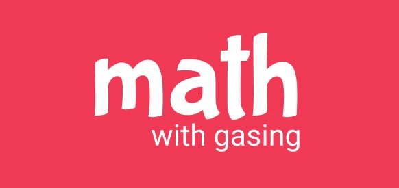

# Math with Gasing

Deskripsi singkat tentang proyek ini.

## Fitur Utama

- **Kelola Akun:** Dengan fitur ini, pengguna dapat mengelola akun siswa dan admin secara terpisah, memungkinkan untuk administrasi yang efektif.
- /**
 * Fitur Kelola Akun memungkinkan admin untuk melakukan manajemen akun siswa dan admin
 * secara terpisah. Ini meliputi fungsi-fungsi seperti pembuatan, pengeditan, dan penghapusan akun,
 * serta pengaturan peran dan izin akses yang sesuai.
 */
  
- **Kelola Materi:** Integrasi dengan aplikasi untuk mengelola materi secara efisien dan terstruktur.
- /**
 * Fitur Kelola Materi memfasilitasi integrasi dengan aplikasi untuk mengelola materi pelajaran.
 * Pengguna dapat menambah, mengedit, dan menghapus materi secara terstruktur, serta mengelompokkannya
 * berdasarkan topik atau kurikulum untuk mempermudah pengelolaan konten pendidikan.
 */

- **Kelola Lencana:** Pengelolaan lencana untuk memberikan pengakuan kepada prestasi siswa secara visual.
- /**
 * Fitur Kelola Lencana memungkinkan admin untuk mengelola sistem pengakuan prestasi siswa
 * melalui pemberian lencana. Admin dapat membuat, menetapkan kriteria pemberian, serta memberikan
 * lencana kepada siswa yang mencapai prestasi tertentu, memperkuat motivasi dan penghargaan dalam
 * lingkungan pendidikan.
 */

- **Pencapaian Siswa:** Melacak dan memvisualisasikan pencapaian siswa untuk memotivasi dan memantau perkembangan mereka.
- /**
 * Fitur Pencapaian Siswa memungkinkan pengguna untuk melacak dan memvisualisasikan pencapaian
 * siswa. Ini memungkinkan pendidik dan admin untuk memantau perkembangan akademis dan non-akademis
 * siswa secara langsung, membantu dalam evaluasi dan pengambilan keputusan yang berorientasi pada data.
 */

## Tampilan

### Gambar Pembagian

### Gambar Pengurangan

## Instalasi

Berikut adalah langkah-langkah instalasi proyek ini:

1. Clone repositori ini git clone [https://github.com/username/repo.git](https://github.com/HanzSitinjak/Project_MathGasing.git).
2. Masuk ke direktori proyek.
3. Instal dependencies.
4. Jalankan aplikasi.

Silakan ajukan *pull request* jika ingin berkontribusi pada proyek ini. Pastikan untuk membahas perubahan yang diusulkan terlebih dahulu.
