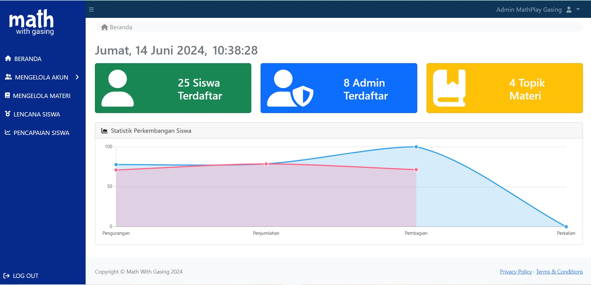
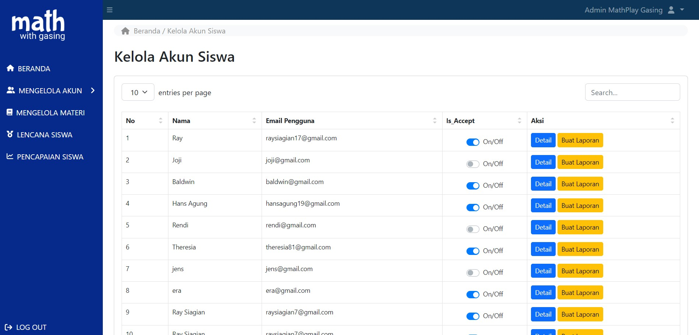
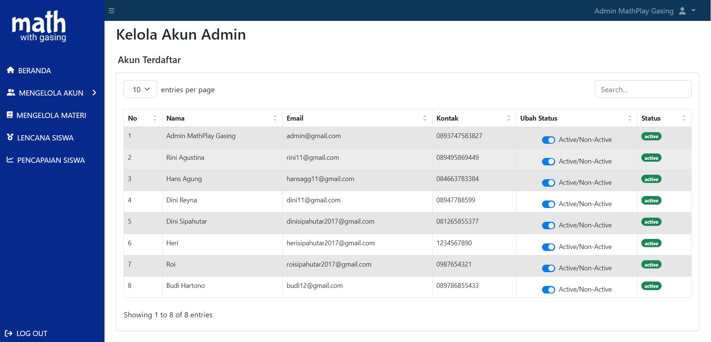
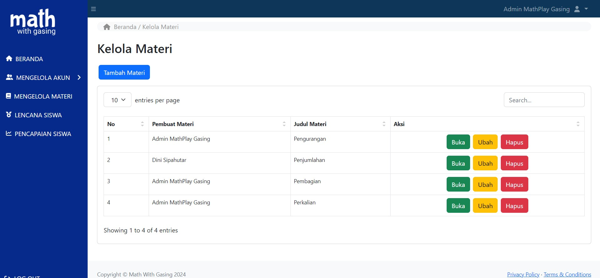
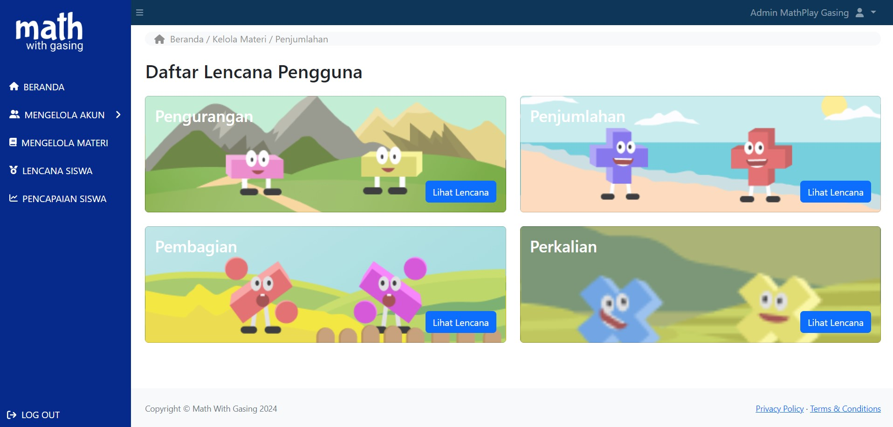
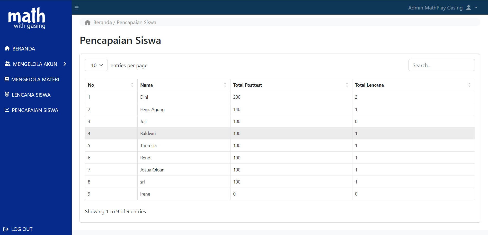

<h1>Math with Gasing</h1>
    

    
Deskripsi singkat tentang proyek ini.

    <h2>Fitur Utama</h2>
    <ul>
        <li>
            <strong>Kelola Akun:</strong> Dengan fitur ini, pengguna dapat mengelola akun siswa dan admin secara terpisah, memungkinkan untuk administrasi yang efektif.
            <pre><code>
            /**
             * Fitur Kelola Akun memungkinkan admin untuk melakukan manajemen akun siswa dan admin
             * secara terpisah. Ini meliputi fungsi-fungsi seperti pembuatan, pengeditan, dan penghapusan akun,
             * serta pengaturan peran dan izin akses yang sesuai.
             */
            </code></pre>
        </li>
        <li>
            <strong>Kelola Materi:</strong> Integrasi dengan aplikasi untuk mengelola materi secara efisien dan terstruktur.
            <pre><code>
            /**
             * Fitur Kelola Materi memfasilitasi integrasi dengan aplikasi untuk mengelola materi pelajaran.
             * Pengguna dapat menambah, mengedit, dan menghapus materi secara terstruktur, serta mengelompokkannya
             * berdasarkan topik atau kurikulum untuk mempermudah pengelolaan konten pendidikan.
             */
            </code></pre>
        </li>
        <li>
            <strong>Kelola Lencana:</strong> Pengelolaan lencana untuk memberikan pengakuan kepada prestasi siswa secara visual.
            <pre><code>
            /**
             * Fitur Kelola Lencana memungkinkan admin untuk mengelola sistem pengakuan prestasi siswa
             * melalui pemberian lencana. Admin dapat membuat, menetapkan kriteria pemberian, serta memberikan
             * lencana kepada siswa yang mencapai prestasi tertentu, memperkuat motivasi dan penghargaan dalam
             * lingkungan pendidikan.
             */
            </code></pre>
        </li>
        <li>
            <strong>Pencapaian Siswa:</strong> Melacak dan memvisualisasikan pencapaian siswa untuk memotivasi dan memantau perkembangan mereka.
            <pre><code>
            /**
             * Fitur Pencapaian Siswa memungkinkan pengguna untuk melacak dan memvisualisasikan pencapaian
             * siswa. Ini memungkinkan pendidik dan admin untuk memantau perkembangan akademis dan non-akademis
             * siswa secara langsung, membantu dalam evaluasi dan pengambilan keputusan yang berorientasi pada data.
             */
            </code></pre>
        </li>
    </ul>

    <h2>Tampilan</h2>
    <h3>Tampilan Login</h3>
    

    <h3>Tampilan HomePage</h3>
    

    <h3>Tampilan Kelola Siswa</h3>
    

    <h3>Tampilan Kelola Admin</h3>
    

    <h3>Tampilan Kelola Materi</h3>
    

    <h3>Tampilan Kelola Lencana</h3>
    

    <h3>Tampilan Pencapaian Siswa</h3>
    

    <h2>Instalasi</h2>
    
Berikut adalah langkah-langkah instalasi proyek ini:

    <ol>
        <li>Clone repositori ini <code>git clone <a href="https://github.com/HanzSitinjak/Project_MathGasing.git">https://github.com/HanzSitinjak/Project_MathGasing.git</a></code>.</li>
        <li>Masuk ke direktori proyek.</li>
        <li>Instal dependencies.</li>
        <li>Jalankan aplikasi.</li>
    </ol>

    
Silakan ajukan <em>pull request</em> jika ingin berkontribusi pada proyek ini. Pastikan untuk membahas perubahan yang diusulkan terlebih dahulu.

